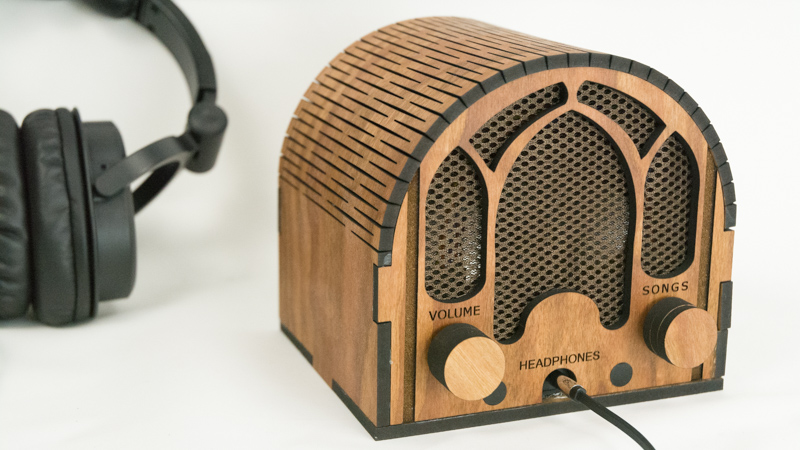

# Dementia Friendly Music Player

I was inspired by the documentary Alive Inside, which shows the profound joy that music can bring to people with dementia. But my Dad could no longer operate CD players or iPods. But he could use this, because it operates like a familiar 1940s radio (but with a Pi & music files inside). 

Goals: 
1. Bring the joy of music to those dementia 
2. Bring the joy of meaningful giving to makers 

47 million people worldwide have dementia. People with dementia often travel back in time by literally forgetting the most recent decades (and modern tech). Thus the vintage user interface of this device. 

The build process is easy -- no soldering, no woodworking. You can make this. Kids can make this.

You can choose between a wood enclosure (photo above) or a 3D printed enclosure. Special thanks to Trey Bagley for designing the gorgeous retro-style 3D printed enclosure.

Everything you need is in this repository e.g. software, build instructions, laser cutting (wood) files, and 3D printing files, detailed step-by-step build instructions with photos. If you have a laser cutter or a 3D printer, you can do this at home. Alternatively, you can send the files to an online service of your choice to laser cut or 3D print the enclosure.

For more information, see http://DementiaMusicPlayer.org. 
